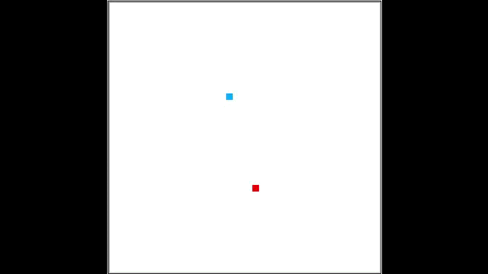
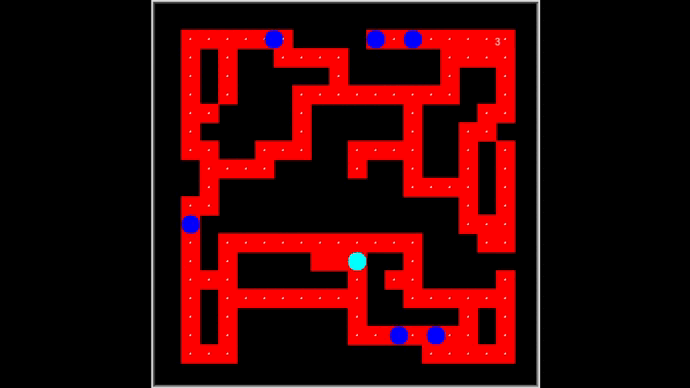
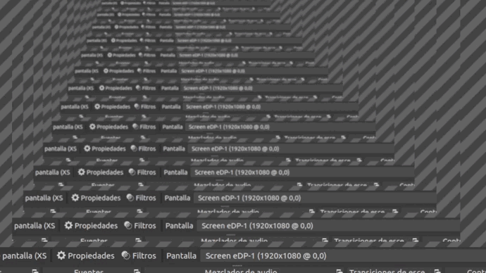

<div id="top"></div>

<!-- PROJECT LOGO -->
<br />
<h3>Proyecto juegos</h3>

<h4>Carlos Yahir Herrera Rodríguez A01798203</h4>
<br>
<h4>Igancio Solís Montes A0151213</h4>

<br />

<details>
  <summary>Table of Contents</summary>
  <ol>
    <li>
      <a href="#getting-started">Imagenes juegos</a>
      <ul>
        <li><a href="#prerequisites">Logs commits/a></li>
    
      </ul>
    </li>
  </ol>
</details>


<br />

### Imagenes juegos





<br />

### Logs commits

Log de los commits realizados
   ```sh
   commit bade02a40e554e96ac2d0c5d5fdcb72e0b07b3f7 (HEAD -> main, origin/main, origin/HEAD)
Author: CarlosHerreraR <A01798203@tec.mx>
Date:   Thu May 11 17:02:45 2023 -0600

    Documentación pintando

commit 79ab40088c18a8155f760ff9ef93bca27234403e
Author: CarlosHerreraR <A01798203@tec.mx>
Date:   Thu May 11 16:37:38 2023 -0600

    Documentación memoria

commit df23a009d61d3e07e9db19a010188a952a59d559
Author: CarlosHerreraR <113319999+CarlosHerreraR@users.noreply.github.com>
Date:   Wed May 10 22:11:22 2023 -0600

    Delete Prueba.py

commit 3dafbcc60d1d413889828314a9d9952eaf371103
Author: A01751213 <117104365+A01751213@users.noreply.github.com>
Date:   Wed May 10 22:10:40 2023 -0600

:...skipping...
commit bade02a40e554e96ac2d0c5d5fdcb72e0b07b3f7 (HEAD -> main, origin/main, origin/HEAD)
Author: CarlosHerreraR <A01798203@tec.mx>
Date:   Thu May 11 17:02:45 2023 -0600

    Documentación pintando

commit 79ab40088c18a8155f760ff9ef93bca27234403e
Author: CarlosHerreraR <A01798203@tec.mx>
Date:   Thu May 11 16:37:38 2023 -0600

    Documentación memoria

commit df23a009d61d3e07e9db19a010188a952a59d559
Author: CarlosHerreraR <113319999+CarlosHerreraR@users.noreply.github.com>
Date:   Wed May 10 22:11:22 2023 -0600

    Delete Prueba.py

commit 3dafbcc60d1d413889828314a9d9952eaf371103
Author: A01751213 <117104365+A01751213@users.noreply.github.com>
Date:   Wed May 10 22:10:40 2023 -0600

    memoria cambios1

commit 9336d0111ec9e9e929fdc1fab733dc11d09c5bfb
Author: CarlosHerreraR <A01798203@tec.mx>
Date:   Wed May 10 20:47:59 2023 -0600

    Packman cambios 2

commit c7d469561dba6fea5b5e7444e2634e319638fff4
Author: A01751213 <117104365+A01751213@users.noreply.github.com>
Date:   Wed May 10 20:41:21 2023 -0600

    packman cambios1

commit 6709e2ff70614222b378e6c647b2640e6ad97c05
Author: CarlosHerreraR <A01798203@tec.mx>
Date:   Wed May 10 20:03:09 2023 -0600

    Pintando cambios 2

commit ae7c62e8e6ad3de57d04e5c9829346a82ad82660
Author: A01751213 <117104365+A01751213@users.noreply.github.com>
Date:   Wed May 10 19:50:24 2023 -0600

    Pintando cambios1

commit 6e196d6bc8dee35e2b00717a5a7d84e6a4d71b8a
Author: A01751213 <117104365+A01751213@users.noreply.github.com>
Date:   Wed May 10 11:40:58 2023 -0600

    Tiro parabolico cambios2

commit 32f91c286be69c65a537f1e102acf5140bab3c44
Merge: 75dc865 96bf5e2
Author: CarlosHerreraR <A01798203@tec.mx>
Date:   Wed May 10 11:20:52 2023 -0600

    Tiro parabolico cambios 1

commit 75dc865624f516920115fae516fa163fd48cf7b3
Author: CarlosHerreraR <A01798203@tec.mx>
Date:   Wed May 10 11:14:04 2023 -0600

    Tiro parabolico  parte 1

commit 96bf5e2fc66a7cc7ce8f71411feb12c4d5d1c273
Author: CarlosHerreraR <113319999+CarlosHerreraR@users.noreply.github.com>
Date:   Wed May 10 11:07:45 2023 -0600

    Delete GitHubDesktop-linux-3.1.1-linux1.deb

commit c3e28910042d5d4b67640c08a6926ab8e1d197e2
Author: CarlosHerreraR <113319999+CarlosHerreraR@users.noreply.github.com>
Date:   Wed May 10 11:07:37 2023 -0600

    Delete GitHubDesktop-linux-2.8.1-linux2.deb

commit 2fbe43f355585f5f60f46d10ca6605177d190110
Author: A01751213 <117104365+A01751213@users.noreply.github.com>
Date:   Wed May 10 11:06:40 2023 -0600

    Snake cambios 2

commit c3a7484e1ab958c2c17c36b58215d2bee14f590c
Merge: abcf818 77ab389
Author: CarlosHerreraR <A01798203@tec.mx>
Date:   Wed May 10 10:55:55 2023 -0600

    Merge branch 'main' of https://github.com/CarlosHerreraR/ProyectoSemanaTec into main

commit abcf818d360ba51f831265d1887da533f9485aac
Author: CarlosHerreraR <A01798203@tec.mx>
Date:   Wed May 10 10:54:55 2023 -0600

    Snake cambios 1

commit 77ab38984a093533e38049b5315ad6ef462b9a05
Author: CarlosHerreraR <113319999+CarlosHerreraR@users.noreply.github.com>
Date:   Wed May 10 09:14:44 2023 -0600

    Delete .DS_Store

commit 378a41be4d7614550687376cb1a5239027ab0097
Author: CarlosHerreraR <113319999+CarlosHerreraR@users.noreply.github.com>
Date:   Wed May 10 09:14:29 2023 -0600

    Delete juego

commit 1d23dc9f4a94a98dc22f00a7892255371118c8fa
Author: CarlosHerreraR <113319999+CarlosHerreraR@users.noreply.github.com>
Date:   Wed May 10 09:14:18 2023 -0600

    Delete de

commit ec849203ae189be0127a47fe2e590e09308a3e6b
Author: A01751213 <117104365+A01751213@users.noreply.github.com>
Date:   Wed May 10 09:13:19 2023 -0600

    Archivo base

commit a01058d319c120546e277c5216801ee3c3aa500a
Merge: a2c140c e595581
Author: A01751213 <117104365+A01751213@users.noreply.github.com>
Date:   Wed May 10 09:08:51 2023 -0600

    fusion

commit a2c140c4841724968e19911adbf07f01f6654bd1
Author: A01751213 <117104365+A01751213@users.noreply.github.com>
Date:   Wed May 10 09:02:35 2023 -0600

    archivo base

commit e5955815e6a56dca014c6092012a9e780d226472
Merge: a9ef387 e7a4153
Author: Carlos Herrera <A01798203@tec.mx>
Date:   Wed May 10 08:58:48 2023 -0600

    Merge branch 'main' of https://github.com/CarlosHerreraR/ProyectoSemanaTec into main

commit a9ef3873bb7b66fce9dfc2a10adba170eb6a90de
Author: Carlos Herrera <A01798203@tec.mx>
Date:   Wed May 10 08:57:39 2023 -0600

    Archivo Base

commit e7a415315860076a7a1665e11a06751c8f509ea1
Author: A01751213 <117104365+A01751213@users.noreply.github.com>
Date:   Wed May 10 08:54:44 2023 -0600

    archivo base

commit 41af1c55fa6fcfa80f416fadd21e79479a07488b
Author: Carlos Herrera <A01798203@tec.mx>
Date:   Wed May 10 08:49:29 2023 -0600

    Archivo Base

commit f8f1c4b30d1635c63e466caefc3afac712bad0e7
Author: Carlos Herrera <A01798203@tec.mx>
Date:   Wed May 10 08:46:03 2023 -0600

    Archivo Base

commit ac5a55c284cd032ff7394e8f24e0658db767326e
Author: CarlosHerreraR <113319999+CarlosHerreraR@users.noreply.github.com>
Date:   Wed May 10 08:42:18 2023 -0600

    Initial commit

   ```

  


<p align="right">(<a href="#top">back to top</a>)</p>
